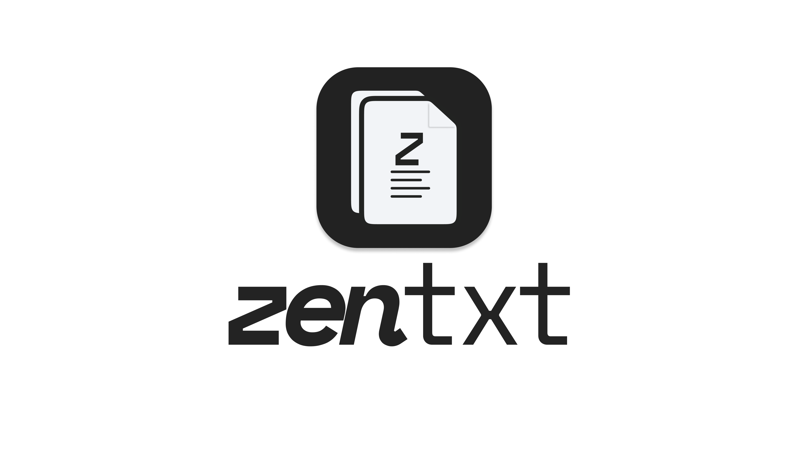

<p align="center">
  
</p>

zentxt is a stupidly simple tool for versioning text documents — no commands, no learning curve. Inspired by Steve Jobs' philosophy of simplicity and Apple's minimalist design, zentxt lets anyone track file changes effortlessly.

No branches. No jargon. Just your files, with a memory.

---

## Getting started

**With Go**
```bash
git clone https://github.com/Adriusops/zentxt
cd zentxt
go run ./cmd/zentxt/
```

**With Docker**
```bash
docker build -t zentxt .
docker run -p 3000:3000 zentxt
```

Your API is now running at `http://localhost:3000`.

---

## API

| Method | Endpoint | Description |
|--------|----------|-------------|
| `GET` | `/files` | List all tracked files |
| `POST` | `/files` | Track a new file |
| `GET` | `/files/:id` | Get a file |
| `POST` | `/files/:id/versions` | Save a new version |
| `GET` | `/files/:id/versions` | List all versions |
| `GET` | `/files/:id/versions/:version_id` | Get a specific version |
| `GET` | `/files/:id/diff?v1=&v2=` | Compare two versions |
| `PATCH` | `/files/:id/restore/:version_id` | Restore a version |

---

## Stack

**Backend** — [Go](https://golang.org) with [Fiber v3](https://gofiber.io). Fast, minimal, a single binary. No runtime dependencies.

**Database** — [SQLite](https://sqlite.org) via [modernc.org/sqlite](https://pkg.go.dev/modernc.org/sqlite). Local-first by design — your data stays on your machine, in a single file.

**Diff engine** — [go-diff](https://github.com/sergi/go-diff). Computes character-level diffs between versions on the fly, no storage overhead.

**Containerization** — Docker with a multi-stage build. The final image is under 20MB.

**CI** — GitHub Actions. Every push to `main` compiles the project and runs the test suite automatically.

No cloud. No configuration. No account required.

---

## Philosophy

zentxt does one thing well. It remembers your text files so you don't have to.

> "Simplicity is the ultimate sophistication." — Steve Jobs

---

## A personal note

zentxt is a solo side project, built with love and a genuine belief that software can be both useful and simple. It's also how I'm learning Go and DevOps in the open — one commit at a time.

If you believe in what this is trying to be, feel free to star, fork, or just say hi. 👋
